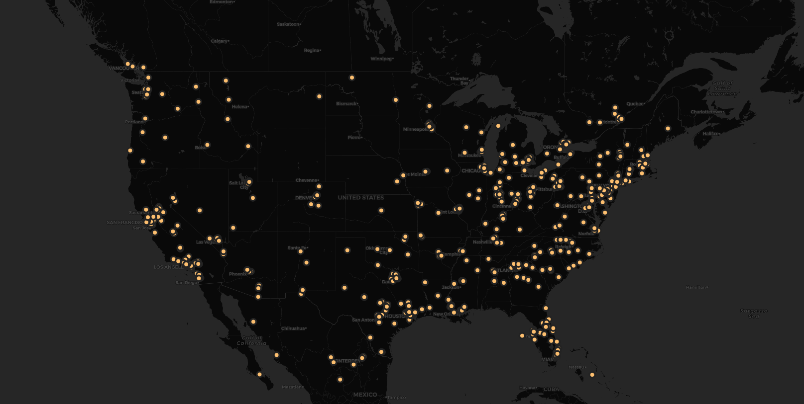

this map shows that during the time period, tweets mainly cluster around urban areas. It also seems that tweets are more active on the eastern side than the western side of the states, which could possibly be due to the fact that the eastern side has more big cities. 
